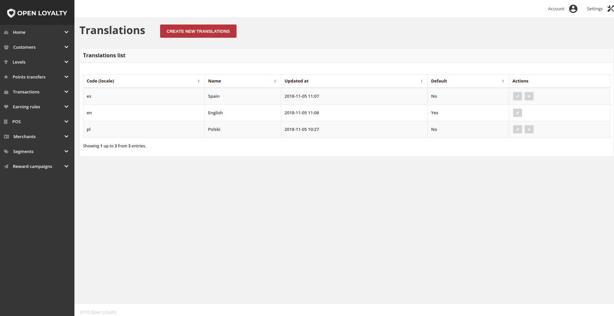

How to change main language
===========================

English language is default language in OpenLoyalty for data and interfaces. In case of change main language you need
to adjust OpenLoyalty to new language.

Backend system translations
---------------------------

In order to translate system messages from backend (API) you need to create translations files in ``backend/app/Resources/translations``
as well like for PL and EN. Create file messages.LOCALE.xlf and validators.LOCALE.xlf.

Frontend translations for interface and data
--------------------------------------------

To creates new translations for interfaces in cockpits, open ``Settings/Translations`` and click ``Create new translations``.
Fill in the form for your new language (locale code), mark new translations as default. In content field you have to put
translations for your languages according to EN structure. You can simple copy content from EN translations and translate it.
In some cases flush browser cache is required to reload new language in admin cockpit.

That's all. Now frontend interface will use your translations and default language for data will use new language as well.
Make sure that required fields for default language are filled in translatable object like Campaigns, Levels etc.

