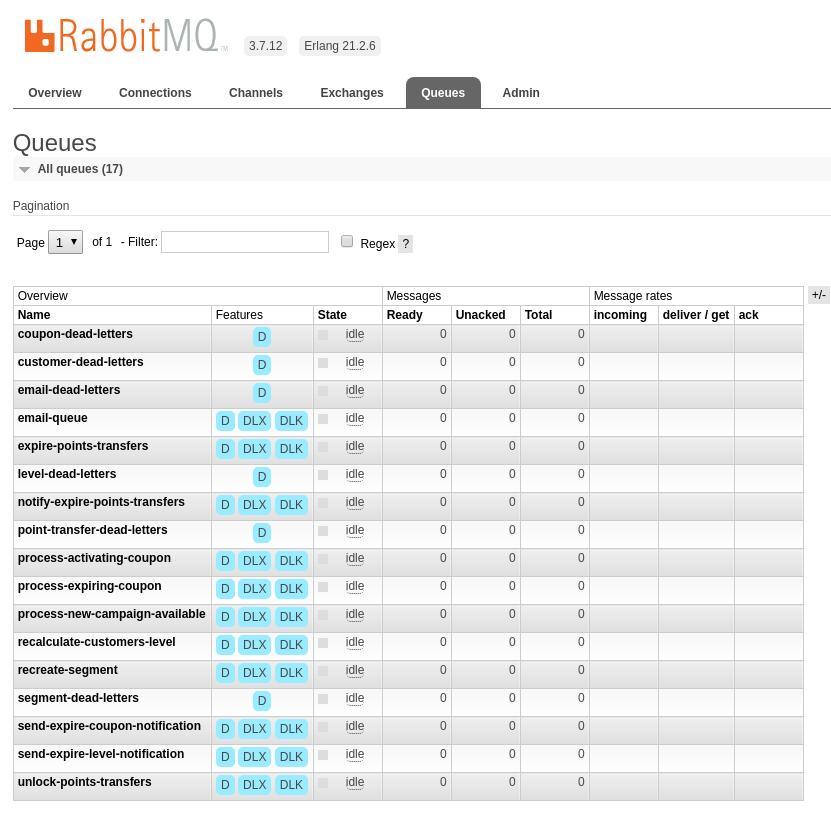

RabbitMQ Management
===================

It is always more readable when you can preview what is really happening on the Queue's server side.

RabbitMQ Management panel
-------------------------

Our docker dev-environment configuration contains definition for a web-based RabbitMQ management panel which is
accessible on default gateway IP for docker (localhost for linux and 192.168.X.X IP for windows) on port 8672
(ie. http://localhost:8672 or http://192.168.x.x:8672 ).

Default credentials are ``guest`` / ``guest``

