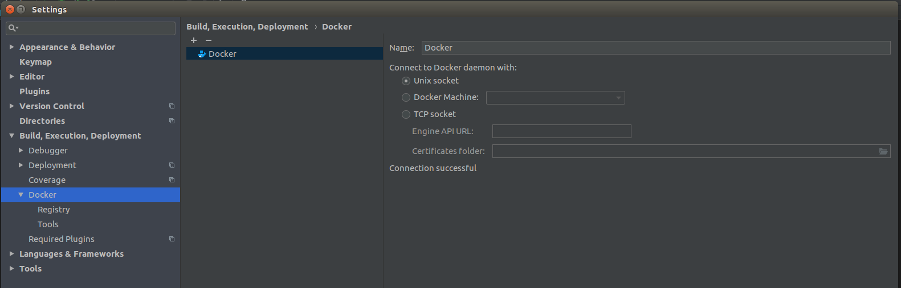
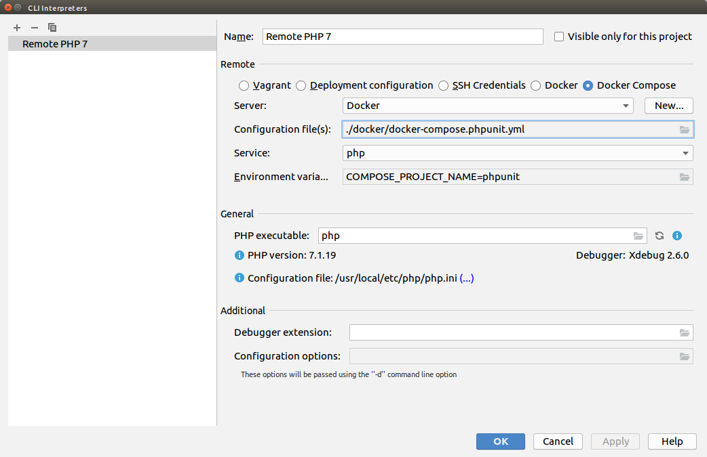
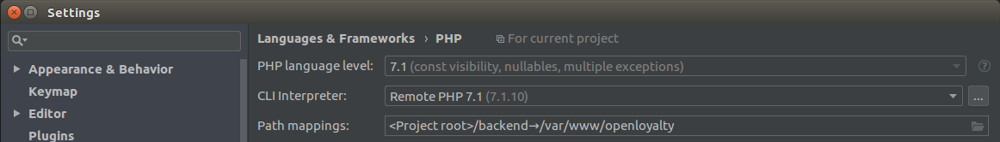
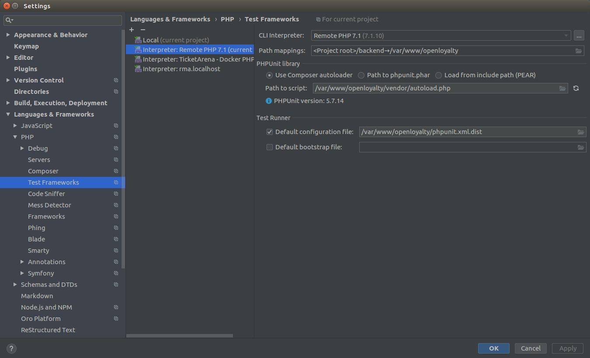
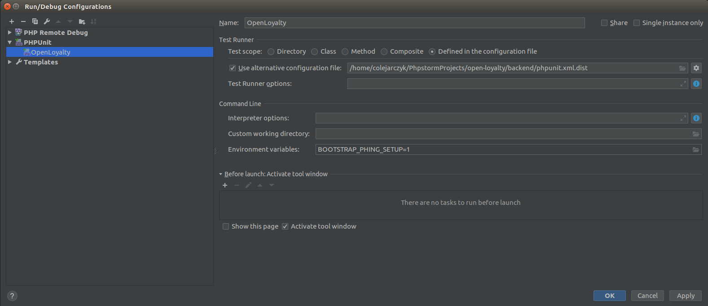

Unit & integration tests in PHPStorm
====================================

This guideline is about how to configure PHPStorm to run unit & integration tests locally.

Requirements
------------
- docker-compose (>= 1.21)
- docker (>= 18.06)
- PHPStorm (>= 2018.1)

Setup
-----

1. Enter settings: File → Settings → Build, Execution, Deployment → Docker

2. File → Settings → Languages & Frameworks → PHP

a) Configure CLI Interpreter

b) Configure PHP settings

3. File → Settings → Languages & Frameworks → PHP → Test Frameworks and then configure PHPUnit by adding Remote Interpreter

4. Run/Debug Configuration

Now you are able to execute all tests via IDE using green ``Play`` button or ``Run`` menu.
