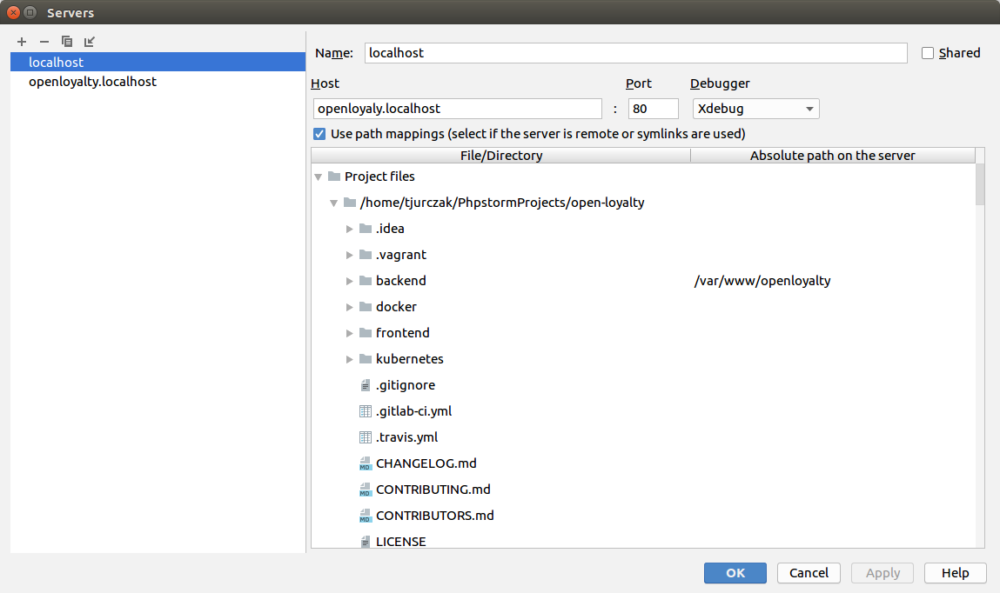
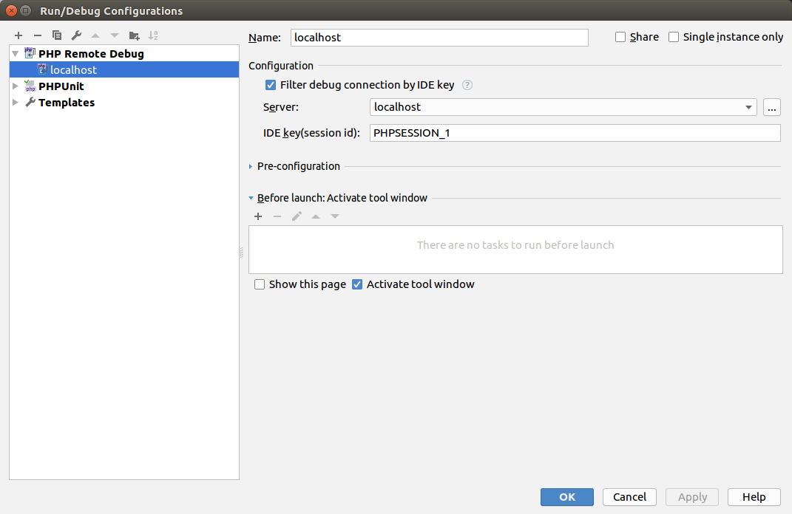

Xebug with PHP Storm
====================

Xdebug is a php extension which is included in developer's environment built with docker (described in installation section).
It can be configured next to IDE, but it's more valuable to get xdebug synchronized with your IDE (PHP Storm in this case).

IDE configuration
-----------------

1. Set the right port
*********************

In PHP Storm settings (Languages & Frameworks / PHP / Debug / Xdebug / Debug port) set `port` to `10001`.

.. note::

    Default port 9000 is being used by PHP container

2. Create remote debug
**********************

In settings (Run/Debug/Edit configurations) add new Configuration called `PHP Remote Debug`.

3. Create new server
********************

Create a new server by clicking `...` using settings like in the picture below

4. Select created server
************************

Select newly created server and save.

.. note::

    xdebug setup for php dev container is set up in file located in `docker/dev/php/xdebug.ini`

Debugging through php-fpm (front)
---------------------------------

Should work automatically when `Start Listening for PHP Debug connections` option is switch on.

Debugging through php-cli (backend)
-----------------------------------

It can be done after doing a few steps.

1) run command `docker inspect open_loyalty_backend | grep Gateway`
the output should contain a value of `Gateway` key. Copy this IP.

2) on running php container run this command:
``export PHP_IDE_CONFIG="serverName=localhost"``

.. note::

    notice the serverName value is `localhost` - the same value as configured in the step called `Create new server`

3) If you have switched `listening` debug option on - you can run any php command with required prefixes, here's an example:

``php -dxdebug.remote_host=172.18.0.1 -dxdebug.remote_autostart=On bin/console``

